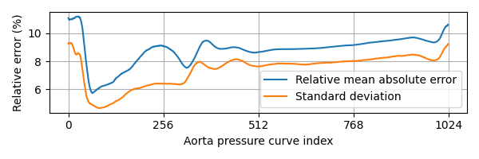

# EIT-Ventilation-Perfusion-Estimator
Application of a VAE and a mapper for arterial pressure curve reconstruction of real world experimental data.

**Results**

    

    <em><b>Figure 1: </b>Mean, standard deviation, and variance of the error between the true and predicted aorta pressure curves visualized along the resampled aorta curve index k.</em>

